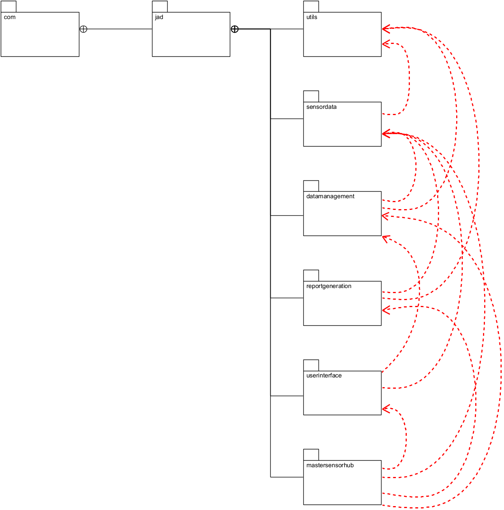

# MavenSensorHub

# Dépendances entre modules

# Made with ❤️ by [JAD](mailto:jeanaymeric@gmail.com)

## Objectif :

Un applicatif de pilotage de capteurs (température, humidité, pression et vitesse du vent) a été développé.
L'ensemble du code de cet applicatif vous est fourni.
Il s'agit d'un projet Maven, développé en java 21, avec JUnit 5 pour les tests unitaires.
Il est composé de différents modules :

- `main-application` : le module principal de l'application
- `sensor-generation` : le module permettant de générer des données de capteurs
- `data-management` : le module permettant de gérer les données de capteurs
- `report-generation` : le module permettant de générer des rapports sur les données de capteurs
- `user-interface` : le module permettant d'interagir avec l'utilisateur
- `utils` : le module contenant des classes utilitaires

L'applicatif est fonctionnel et vous pouvez le tester en exécutant la classe `Main` du module `main-application`.
Un prompt de commande s'ouvre et vous propose de choisir une action à réaliser.

Vérifier que c'est le bon jdk qui est utilisé. Pour cela, allez dans le menu `File` > `Project Structure` > `Project`.
Vérifiez que le `Project SDK` est bien configuré sur le jdk 21.

Pour avoir la liste des commandes disponibles, tapez `help`.

Voici le **diagramme de packages** de l'application :

Les flèches en rouge représentent les dépendances entre les modules.

Comme vous pouvez le voir, le module main-application dépend de tous les autres modules, ce qui est normal.
Cependant, les autres modules ont beaucoup trop de dépendances entre eux.

Cela rend l'application difficile à maintenir et à faire évoluer.

Ceci est encore plus visible avec le **diagramme de classes** de l'application. Ce dernier a été simplifié. Seules les
classes apparaissent.

Aucune méthode ou attribut n'est affiché. De plus les relations (association, agrégation, composition) sont présentes,
mais sans les roles ou els multiplicités.

Les flèches en rouge représentent les dépendances entre les classes.

Et oui, il y en a beaucoup !

Vous allez devoir réorganiser les classes et les packages de l'application pour réduire les dépendances entre les
modules.
Il vous faudra très certainement créer de nouveau(x) module(s) pour y déplacer des classes.
Heureusement, les développeurs ont créé des interfaces, des enumérations et des records. Tout n'était pas mauvais dans
leur code.

### Aucune modification de code n'est nécessaire.

Vous ne devez pas modifier le code des classes (à part les imports
bien
entendu, mais votre IDE va gentiment s'en charger pour vous).

## Validation

Des tests unitaires sont fournis pour valider votre implémentation.

À chaque `commit and push`, les tests sont exécutés automatiquement par GitHub Actions.

Certains tests passent, d'autres échouent. Naturellement, ceux qui échouent sont ceux qui rapportent des points.
Cela ne veut pas dire que les tests qui ne rapportent pas de points sont inutiles. Ils doivent, eux aussi passer quoi
qu'il arrive.

Pour visualiser les résultats des tests, cliquez sur l'onglet `Actions` de votre dépôt GitHub.
Cliquez ensuite `Autograding` pour voir le détail des tests.

Pour le moment, les dépendances entre les modules sont mauvaises. Les tests échouent donc.
